# Orange 分布式图床

基于 **C++ HTTP 服务 + React 前端 + MySQL / Redis + FastDFS** 的文件与图床系统。开发时通过 **8080** 访问页面，**8081** 为后端 API；生产环境通常由 Nginx 终结上传并反代 `/api`。

---

## 技术栈概览

| 层级 | 说明 |
|------|------|
| 网络与并发 | Reactor（epoll）、线程池处理耗时 API |
| 数据 | MySQL 持久化元数据；Redis 缓存 token、文件计数、分享集合等 |
| 存储 | FastDFS 存对象；`tc_http_server.conf` 中配置 `client.conf` 与 Web 访问地址 |
| 日志 | spdlog |
| 前端 | React 打包产物位于 `tc-front/` |

---

## 架构与模块关系

### 开发环境（当前仓库默认跑法）

浏览器只访问 **8080**；**MySQL / Redis** 在 **Docker 容器**里，端口映射到宿主机；**C++ 后端**与 **Python 反代**跑在 **宿主机**（VM 里的 Ubuntu），通过 `127.0.0.1` 连容器映射端口。**FastDFS** 不在 `docker-compose.yml` 里，需本机另行安装配置（与 `tc_http_server.conf` 中 `dfs_path_client` 等一致）。

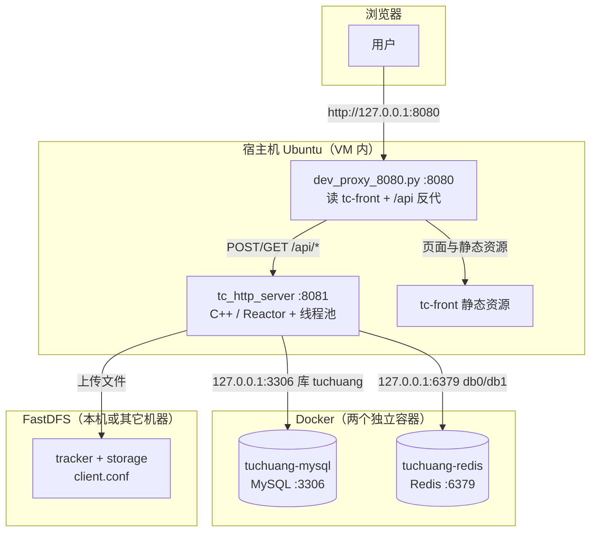

要点：**不是**「整个项目装在一个容器里」；compose 只起 **数据库与缓存**，业务进程在宿主机。

### 生产环境（参考）

生产常见做法是 **Nginx** 对外端口（如 80/443）：静态资源、`/api` 反代到 `tc_http_server`，大文件上传可走 Nginx upload 模块再转后端（见仓库根目录 `nginx.conf` 示例）。数据层仍可为 Docker 或物理机上的 MySQL/Redis；文件仍在 **FastDFS**。

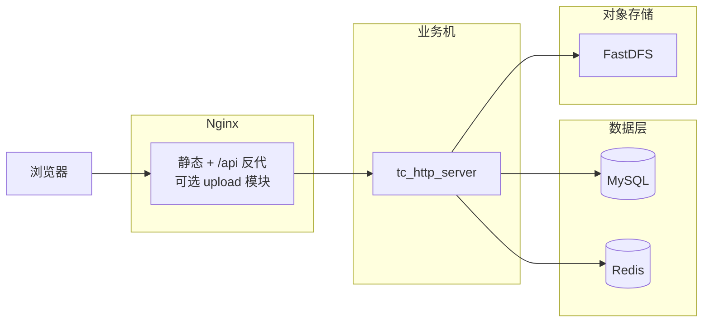

### 后端 `tc-src` 内部分层（逻辑结构）

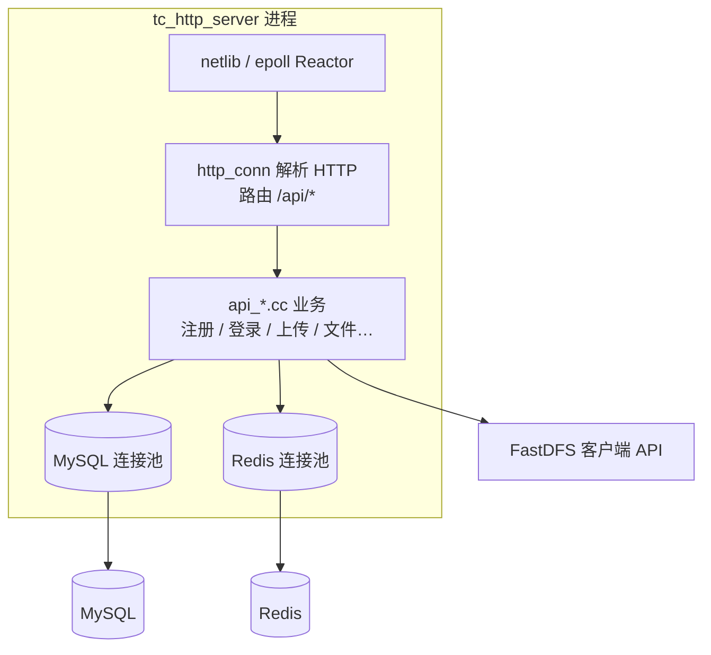

### 可选：短链模块

`tc_http_server.conf` 中 **`enable_shorturl=1`** 时，上传等流程可经 **gRPC** 调用 `shorturl/` 下 Go 服务生成短链接；默认课程/本地联调多为关闭状态。

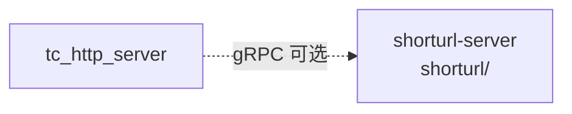

---

## 仓库目录结构

```
my_tuchuang/
├── README.md                 # 本说明
├── docker-compose.yml        # 本地 MySQL(3306) + Redis(6379)，密码与配置一致
├── tuchuang.sql              # 默认库「tuchuang」表结构（Docker 首次初始化会执行）
├── tuchuang_noindex.sql      # 无部分索引的库（性能对比实验用）
├── tuchuang_index.sql        # 带索引的对比库
├── tuchuang_clear.sql        # 清空业务表（慎用）
├── nginx.conf                # 生产部署可参考的 Nginx 示例
├── display/                  # 运行界面截图（自行放入，见下文「运行界面展示」）
├── wrk/                      # wrk 压测工具源码 + Lua 脚本（上传 multipart 等）
├── scripts/
│   ├── run-dev-8080.sh       # 推荐：一键起后端 8081 + 8080 静态与 /api 反代
│   ├── docker-stack.sh       # 统一调用 docker compose 或 docker-compose
│   ├── ensure-mysql-tuchuang.sh  # 旧数据卷无「tuchuang」库时手动导入 SQL
│   ├── dev_proxy_8080.py     # 8080 开发入口（由 run-dev-8080.sh 调用）
│   ├── bootstrap-deps.sh     # 拉取 MariaDB 客户端等到 .deps（供 CMake 使用）
│   ├── run-backend.sh        # 仅启动 tc_http_server（需已配置好环境）
│   └── configure-fastdfs.sh  # 一键同步 FastDFS 与 tc_http_server 上传配置
├── tc-src/                   # C++ 服务源码
│   ├── main.cc               # 入口：初始化 DB/Redis 池、监听 HTTP
│   ├── http_conn.cc          # HTTP 解析与 /api 路由
│   ├── api/                  # 各接口实现（注册、登录、上传、文件列表等）
│   ├── mysql/                # 连接池与 SQL
│   ├── redis/                # hiredis 封装、连接池、键名定义 redis_keys.h
│   ├── base/                 # 网络、事件循环、socket 等
│   ├── tc_http_server.conf   # 运行时配置（需复制到 build 目录或工作目录）
│   └── CMakeLists.txt
├── tc-front/                 # 前端构建产物（index.html、static/js 等）
├── shorturl/                 # 短链相关 Go 服务（可选，默认配置可关闭短链）
└── .deps/                    # bootstrap 依赖输出目录（已 .gitignore）
```

---

## 快速运行（开发）

### 1. 依赖

- Docker：用于 MySQL / Redis（无 `docker compose` 子命令时，可用 **`docker-compose`** 或本仓库 **`./scripts/docker-stack.sh`**）。
- 编译：`cmake`、`g++`、项目依赖见 `tc-src/README.md` 与 `scripts/bootstrap-deps.sh`。

### 2. 启动数据库

在仓库根目录：

```bash
./scripts/docker-stack.sh up -d
```

若 MySQL 数据卷是旧的、没有库 **`tuchuang`**（后端日志报 `Unknown database 'tuchuang'`），执行：

```bash
./scripts/ensure-mysql-tuchuang.sh
```

或清空卷后重建（**会删除库内数据**）：

```bash
./scripts/docker-stack.sh down -v
./scripts/docker-stack.sh up -d
```

### 3. 编译后端

```bash
cd tc-src/build && cmake .. && make
cp -f ../tc_http_server.conf .
```

（若尚未建 `build` 目录，先 `mkdir -p tc-src/build`。）

### 3.5 FastDFS 配置同步（首次部署/迁移服务器必做）

```bash
./scripts/configure-fastdfs.sh
```

如 FastDFS 在其它机器，可显式指定 tracker / storage web 地址：

```bash
./scripts/configure-fastdfs.sh --tracker-host 10.0.0.12 --storage-web-ip 10.0.0.12
```

### 4. 一键启动（前端 + API）

在仓库根目录：

```bash
./scripts/run-dev-8080.sh
```

浏览器打开：**http://127.0.0.1:8080/**

---

## 新机器部署（Linux）

本项目可以迁移到其它 Linux 环境，但 `run-dev-8080.sh` 仅负责启动流程，不会自动安装系统依赖或 FastDFS。

### 1. 前置依赖

- 基础工具：`bash`、`python3`、`cmake`、`g++`
- 数据层：MySQL + Redis（推荐用仓库 `docker-compose.yml` 启动）
- FastDFS：`fdfs_trackerd`、`fdfs_storaged`、`fdfs_upload_file`、`fdfs_file_info`
- 代码与产物：仓库目录、`tc-front/` 静态资源、`tc-src/build/tc_http_server`（或在新机重新编译）

### 2. 推荐部署步骤（新机）

在仓库根目录执行：

```bash
# 1) 启 MySQL / Redis
./scripts/docker-stack.sh up -d

# 2) 如需编译后端
mkdir -p tc-src/build
cd tc-src/build && cmake .. && make
cd ../..

# 3) 对齐 FastDFS 与项目配置（建议首次部署必跑）
./scripts/configure-fastdfs.sh

# 4) 启动开发入口（8080 + 8081）
./scripts/run-dev-8080.sh
```

### 3. 迁移时常见注意事项

- `run-dev-8080.sh` 不是安装器：缺少 FastDFS/数据库时会启动失败。
- 机器 IP 变化后，建议重新执行 `./scripts/configure-fastdfs.sh`，同步 `tracker_server` 与 `storage_web_server_*`。
- 开发态图片直链默认映射本机目录 `/home/fastdfs/storage/data`（由 `scripts/dev_proxy_8080.py` 处理 `/group1/M00/...`）。
  - 若新机 FastDFS 数据目录不同，请调整 `--fdfs-data-root` 或脚本默认值。

---

## 查看 MySQL 中的数据

默认连接信息见 `tc-src/tc_http_server.conf`：**主机 127.0.0.1:3306**，库名 **`tuchuang`**，用户 **`root`**，密码 **`123456`**（若已修改以本地为准）。

### 使用 Docker 容器内的客户端（无需本机安装 mysql）

```bash
# 列出表
docker exec -it tuchuang-mysql mysql -uroot -p123456 tuchuang -e "SHOW TABLES;"

# 查看用户
docker exec -it tuchuang-mysql mysql -uroot -p123456 tuchuang --default-character-set=utf8mb4 \
  -e "SELECT id, user_name, nick_name, create_time FROM user_info;"

# 用户文件列表（最近 10 条）
docker exec -it tuchuang-mysql mysql -uroot -p123456 tuchuang \
  -e "SELECT id, user, file_name, md5, create_time FROM user_file_list ORDER BY id DESC LIMIT 10;"

# 全局文件元数据（FastDFS file_id / url 等）
docker exec -it tuchuang-mysql mysql -uroot -p123456 tuchuang \
  -e "SELECT id, md5, LEFT(url,64) AS url_prefix, size FROM file_info ORDER BY id DESC LIMIT 10;"
```

### 本机安装客户端（可选）

```bash
sudo apt install -y mariadb-client
mysql -h127.0.0.1 -P3306 -uroot -p123456 tuchuang -e "SHOW TABLES;"
```

### 主要表含义

| 表名 | 作用 |
|------|------|
| `user_info` | 注册用户 |
| `user_file_list` | 用户与文件的关联（文件名、md5、分享状态等） |
| `file_info` | 文件全局记录（FastDFS `file_id`、URL、引用计数等） |
| `share_file_list` | 共享文件列表 |
| `share_picture_list` | 图床分享记录 |

---

## 查看 Redis 中的数据

默认 **127.0.0.1:6379**。配置中 **token** 使用 **db 0**，**ranking_list** 使用 **db 1**。

### 使用 Docker

```bash
# 连通性
docker exec -it tuchuang-redis redis-cli PING

# db0：列出 key（中文用户名在终端里可能显示为 \x 序列，属正常现象）
docker exec -it tuchuang-redis redis-cli -n 0 KEYS '*'

# 更易读地查看含中文的 key
docker exec -it tuchuang-redis redis-cli -n 0 --raw KEYS '*'
```

### 本机 redis-cli（可选）

```bash
sudo apt install -y redis-tools
redis-cli -h 127.0.0.1 -p 6379 -n 0 PING
```

### 与业务相关的键（定义见 `tc-src/redis/redis_keys.h`）

| 键 / 前缀 | 含义 |
|-----------|------|
| 用户名（字符串） | 登录后写入的 **token**（`SETEX`，TTL 约 24 小时） |
| `FILE_USER_COUNT` + 用户名 | 用户文件数量缓存 |
| `SHARE_PIC_COUNT` + 用户名 | 分享图片数量缓存 |
| `FILE_PUBLIC_ZSET` | 已分享文件的集合（ZSET） |
| `FILE_NAME_HASH` | 文件 id → 展示文件名（HASH） |
| `FILE_PUBLIC_COUNT` | 公共分享数量等计数 |

示例：

```bash
docker exec -it tuchuang-redis redis-cli -n 0 GET orange
docker exec -it tuchuang-redis redis-cli -n 0 GET FILE_USER_COUNTorange
docker exec -it tuchuang-redis redis-cli -n 0 ZCARD FILE_PUBLIC_ZSET
```

---

## 运行界面展示

请将运行效果截图放在仓库根目录下的 **`display/`** 文件夹中（可随仓库一并提交，便于报告或文档展示）。

建议在 `display/` 中使用下列文件名，与本节引用一致（也可改用自己喜欢的名字，并同步改下方 Markdown 路径）：

| 建议文件名 | 内容说明 |
|------------|----------|
| `display/01-login.png` | 登录页 |
| `display/02-register.png` | 注册页 |
| `display/03-myfiles.png` | 我的文件 / 文件列表 |
| `display/04-upload.png` | 上传流程或上传成功提示 |
| `display/05-share.png` | 分享或图床相关页面（若有） |
| `display/06-dev-proxy.png` | 终端中 `run-dev-8080.sh` 或 Docker 运行状态（可选） |
| `display/mysql.png` | MySQL 运行结果（可选） |
| `display/wrk_png.png` | wrk 压测：场景一（8081 上传 `页面.png`）终端输出 |
| `display/wrk_txt.png` | wrk 压测：场景二（8081 上传随机 txt）终端输出 |
| `display/wrk_10000.png` | wrk 压测：场景三（8080 万级并发静态首页）终端输出 |

在图片放入对应路径后，以下引用即可正常显示：


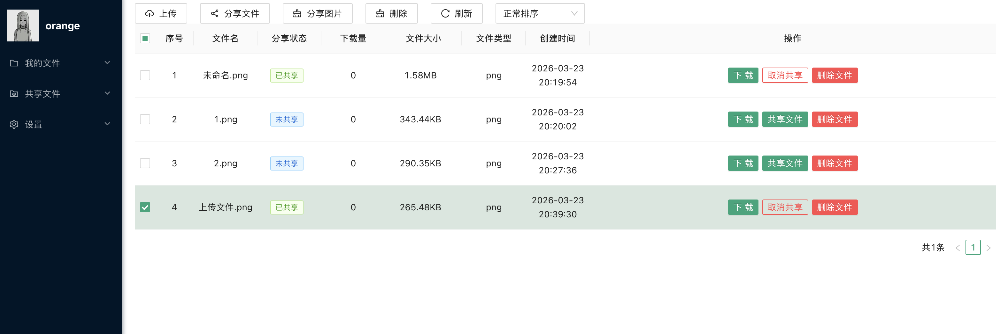


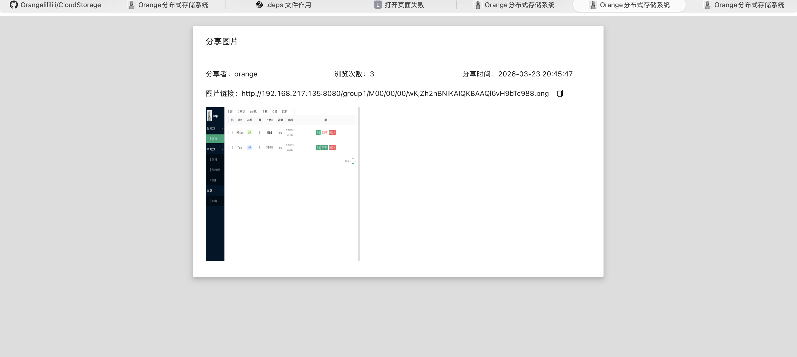

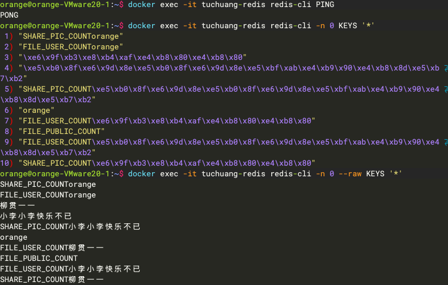

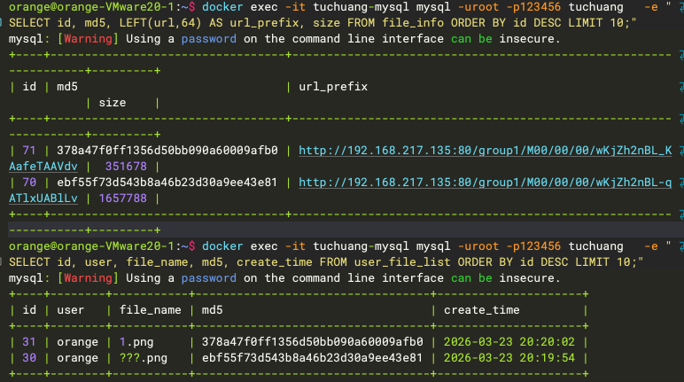

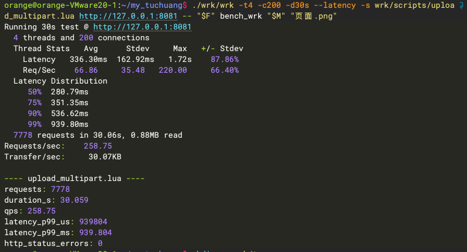

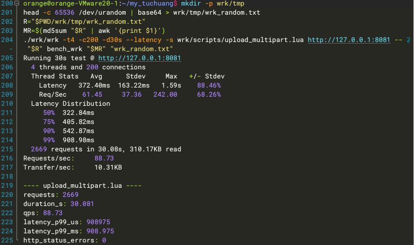

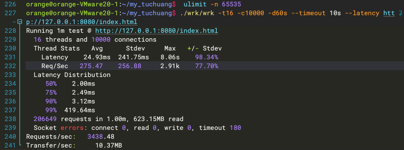

---

## 性能压测（wrk）

仓库内 **`wrk/`** 为 [wrk](https://github.com/wg/wrk) 源码。上传压测使用 **`wrk/scripts/upload_multipart.lua`**：按 `tc-src/api/api_upload.cc` 中「浏览器直传」分支组 **`multipart/form-data`**，字段为 **`user`、`md5`、`size`、`file`**。**QPS** 取 wrk 汇总中的 **Requests/sec**（上传脚本结束时 stderr 中的 **qps** 与其一致）；**P99** 取 **`--latency`** 输出里 **Latency Distribution → 99%**，或与脚本中的 **`latency_p99_ms`** 对照。

**准备**：首次编译 `./wrk/wrk`；上传压测需 **`127.0.0.1:8081`** 上 `tc_http_server`、FastDFS、MySQL、Redis 已就绪。万级并发前建议在压测机执行 **`ulimit -n 65535`**（或更大）。可选一键上传对比：`./wrk/scripts/bench-upload.sh`（环境变量见脚本注释）。

```bash
cd wrk && make -j"$(nproc 2>/dev/null || echo 4)"
```

下文三组数据均在 **同一 VM / 单机** 上复现，**彼此不可混成同一个数字**：场景一、二为 **8081 全链路上传**；场景三为 **8080 静态首页**、**万级并发**，与上传吞吐不是同一类指标。与本节对应的终端截图见 **`display/wrk_png.png`**、**`wrk_txt.png`**、**`wrk_10000.png`**（亦在「运行界面展示」中引用）。

### 场景一：8081 上传 `display/页面.png`

**场景说明**：直连业务端口 **`127.0.0.1:8081`**，payload 为 **`display/页面.png`（约 177KB 级 PNG）**，考察 **FastDFS + 落库** 等全链路在固定并发下的 **QPS** 与 **P99**。表单里的 **md5** 须与文件内容一致。

**命令**（在仓库根目录）：

```bash
F="$PWD/display/页面.png"
M=$(md5sum "$F" | awk '{print $1}')
./wrk/wrk -t4 -c200 -d30s --latency -s wrk/scripts/upload_multipart.lua http://127.0.0.1:8081 -- "$F" bench_wrk "$M" "页面.png"
```

**结果**：

```text
Running 30s test @ http://127.0.0.1:8081
  4 threads and 200 connections
  Thread Stats   Avg      Stdev     Max   +/- Stdev
    Latency   336.30ms  162.92ms   1.72s    87.86%
    Req/Sec    66.86     35.48   220.00     66.40%
  Latency Distribution
     50%  280.79ms
     75%  351.35ms
     90%  536.62ms
     99%  939.80ms
  7778 requests in 30.06s, 0.88MB read
Requests/sec:    258.75
Transfer/sec:     30.07KB

---- upload_multipart.lua ----
qps: 258.75
latency_p99_ms: 939.804
http_status_errors: 0
```

**分析**：在 **`-t4 -c200 -d30s`** 下，该 PNG 全量上传约 **259 QPS**；**P99 ≈ 940ms**，中位与 P90 也在数百毫秒量级，符合「读 body → 临时文件 → FastDFS → MySQL」的重路径。**`http_status_errors: 0`** 表示无 HTTP **≥400**，业务是否全部成功仍以返回 JSON 为准（脚本未解析 body）。

### 场景二：8081 上传随机 txt（multipart）

**场景说明**：与场景一相同 **wrk 与并发**，仅更换 payload：先 **`head -c 65536 /dev/urandom | base64`** 写入 **`wrk/tmp/wrk_random.txt`**，multipart 体积大于 **64KB 原始随机数据**对应的大小，用于和 **PNG** 对比「包体形态/体积」对上传 **QPS**、**P99** 的影响。

**命令**：

```bash
mkdir -p wrk/tmp
head -c 65536 /dev/urandom | base64 > wrk/tmp/wrk_random.txt
R="$PWD/wrk/tmp/wrk_random.txt"
MR=$(md5sum "$R" | awk '{print $1}')
./wrk/wrk -t4 -c200 -d30s --latency -s wrk/scripts/upload_multipart.lua http://127.0.0.1:8081 -- "$R" bench_wrk "$MR" "wrk_random.txt"
```

**结果**：

```text
Running 30s test @ http://127.0.0.1:8081
  4 threads and 200 connections
  Thread Stats   Avg      Stdev     Max   +/- Stdev
    Latency   372.40ms  163.22ms   1.59s    88.46%
    Req/Sec    61.45     37.36   242.00     68.26%
  Latency Distribution
     50%  322.84ms
     75%  405.82ms
     90%  542.87ms
     99%  908.98ms
  2669 requests in 30.08s, 310.17KB read
Requests/sec:     88.73
Transfer/sec:     10.31KB

---- upload_multipart.lua ----
qps: 88.73
latency_p99_ms: 908.975
http_status_errors: 0
```

**分析**：同样 **200 并发**，随机 txt 场景 **QPS 明显低于** 场景一 PNG（约 **89** 对 **259**），**P99 仍在约 0.91s**，与场景一同一量级。差异主要来自 **单次请求体更大、编码与磁盘/存储压力不同**，说明**上传 QPS 必须绑定「文件类型与大小、并发」** 再写结论。

### 场景三：万级并发 + 8080 静态 `index.html`

**场景说明**：压 **`scripts/dev_proxy_8080.py`** 提供的 **`http://127.0.0.1:8080/index.html`**，**`-c10000`** 表示 wrk 侧维持 **1 万条并发连接**，用于观察**开发入口静态链路**在极高并发下的 **QPS**、**延迟分布**与 **超时**。**不宜**用同一 `-c` 直接打超大 multipart 上传（易先打满磁盘与存储）。

**命令**：

```bash
ulimit -n 65535
./wrk/wrk -t16 -c10000 -d60s --timeout 10s --latency http://127.0.0.1:8080/index.html
```

**结果**：

```text
Running 1m test @ http://127.0.0.1:8080/index.html
  16 threads and 10000 connections
  Thread Stats   Avg      Stdev     Max   +/- Stdev
    Latency    24.93ms  241.75ms   8.06s    98.34%
    Req/Sec   275.47    256.88     2.91k    77.70%
  Latency Distribution
     50%    2.00ms
     75%    2.49ms
     90%    3.12ms
     99%  419.64ms
  206649 requests in 1.00m, 623.15MB read
  Socket errors: connect 0, read 0, write 0, timeout 180
Requests/sec:   3438.48
Transfer/sec:     10.37MB
```

**分析**：**Requests/sec ≈ 3438**，即该条件下静态首页 **QPS**；**P99 ≈ 420ms**，而 **P50 / P90 约 2ms / 3ms**，长尾显著。**`timeout 180`** 表示 **180** 次请求在 **`--timeout 10s`** 内仍未结束，写材料时应**主动披露**，避免被读成「零失败」。若生产前经 **Nginx**，需保证 **`worker_connections`** 等不低于目标并发，并把 URL 换成实际站点路径后再复测。

### 压测成果摘要（基于上述实测）

> **成果展示**：在单机 VM 上用 wrk 复现，**8080 静态首页在 1 万并发下约 3438 QPS、P99≈0.42s（含 180 次 10s 超时）**；**8081 全链路上传在 200 并发下，`display/页面.png` 约 259 QPS、P99≈0.94s，同条件大包体随机 txt 约 89 QPS、P99≈0.91s**——静态高并发与上传吞吐须分项表述，且均依赖本文命令与场景方可复现。

补充：上传 QPS 随 **文件大小与类型** 变化显著；万级并发场景针对 **轻量 GET**，与 multipart 上传的瓶颈不同。若经 **Nginx** 或更换机器，需按相同结构重新跑命令并替换文中的结果表。

---

## 配置与端口小结

| 服务 | 端口 | 说明 |
|------|------|------|
| 开发入口（静态 + `/api` 反代） | 8080 | `scripts/dev_proxy_8080.py` |
| `tc_http_server` | 8081 | `tc_http_server.conf` 中 `HttpPort` |
| MySQL | 3306 | `docker-compose.yml` 映射 |
| Redis | 6379 | `docker-compose.yml` 映射 |

FastDFS、`storage_web_server_*` 等见 `tc_http_server.conf`；推荐先执行 `./scripts/configure-fastdfs.sh` 自动对齐配置并自检连通性。开发模式下默认使用 `8080` 作为文件 URL 端口，`scripts/dev_proxy_8080.py` 会将 `/group1/M00/...` 映射到本机 FastDFS 数据目录（默认 `/home/fastdfs/storage/data`）。

---

## 常见问题

1. **`docker compose up -d` 报 `unknown shorthand flag: 'd'`**  
   未安装 Compose 插件时，请使用 **`docker-compose up -d`** 或 **`./scripts/docker-stack.sh up -d`**。

2. **8081 `bind` 失败（err 98）**  
   已有旧的 `tc_http_server` 占用端口；`run-dev-8080.sh` 会尝试释放，亦可手动结束占用 8081 的进程。

3. **编译阶段 protobuf 与 `byte` 宏冲突**  
   若报错指向 `parse_context.h` 中的 `byte`，按 `tc-src/README.md` 将相关局部变量改名为 `byte2` 等（与部分第三方头文件宏冲突）。

4. **更详细的编译与短链 gRPC 说明**  
   见 **`tc-src/README.md`**。

---


